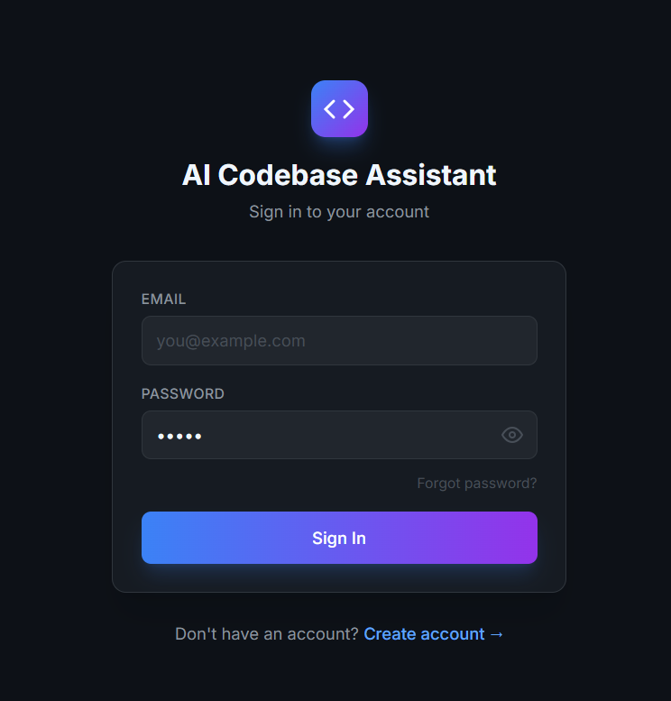
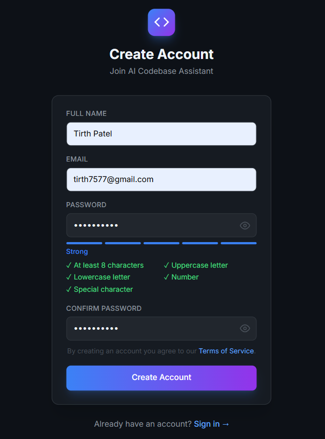
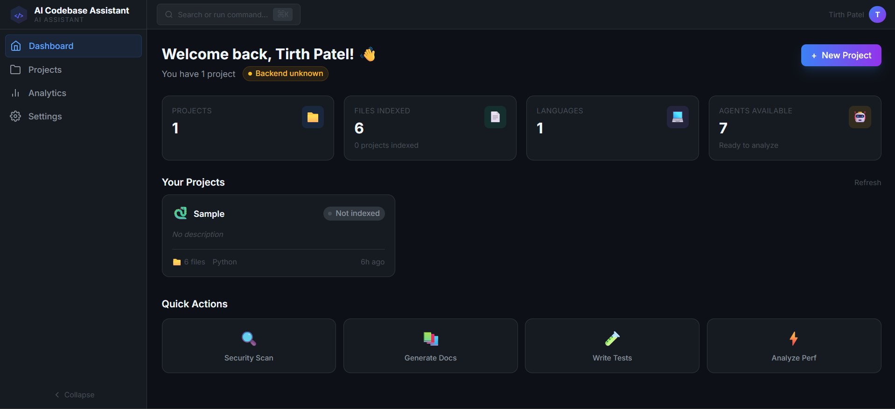
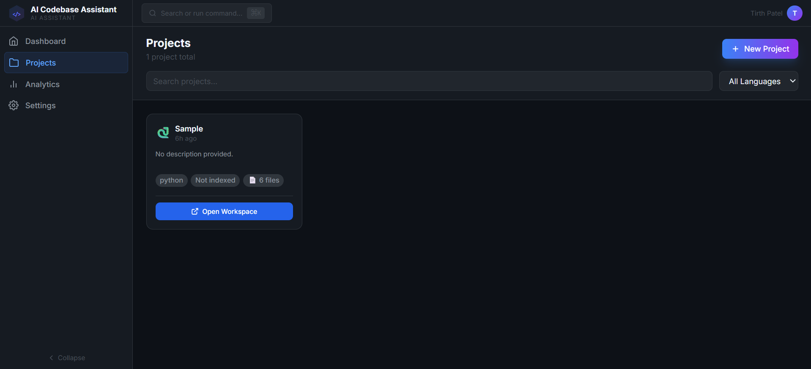
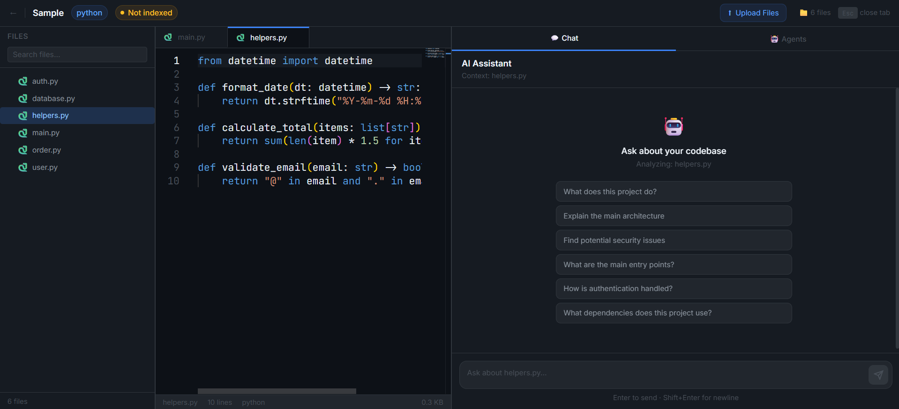
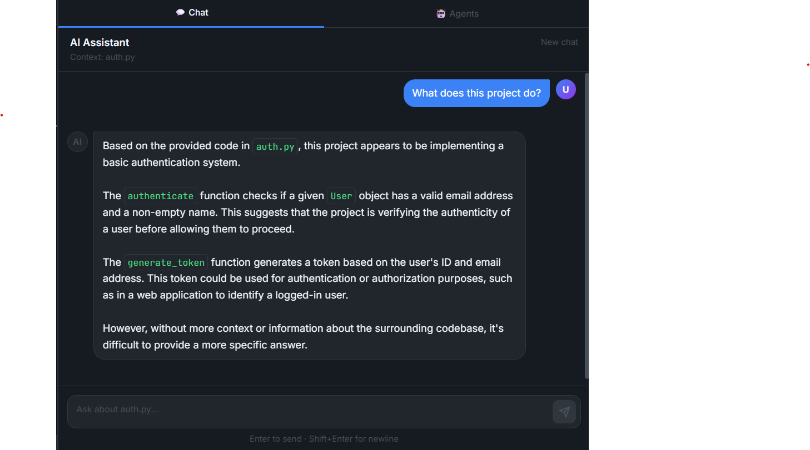
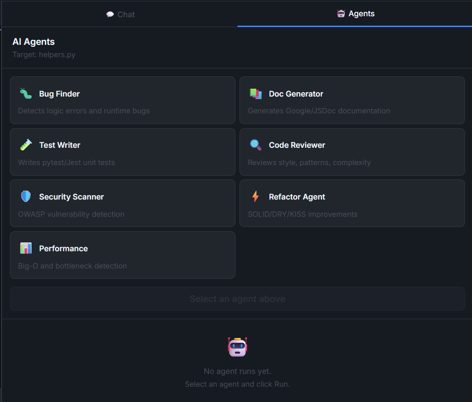
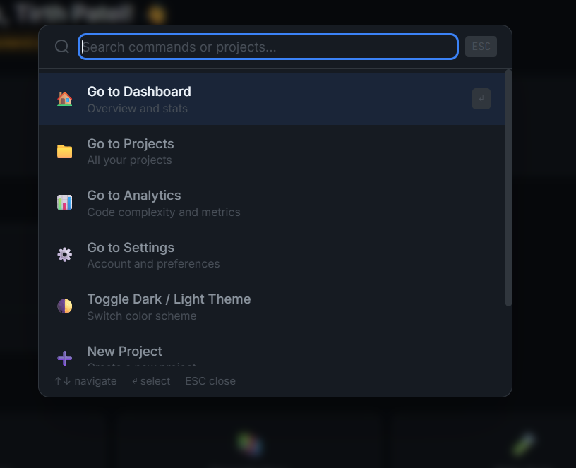
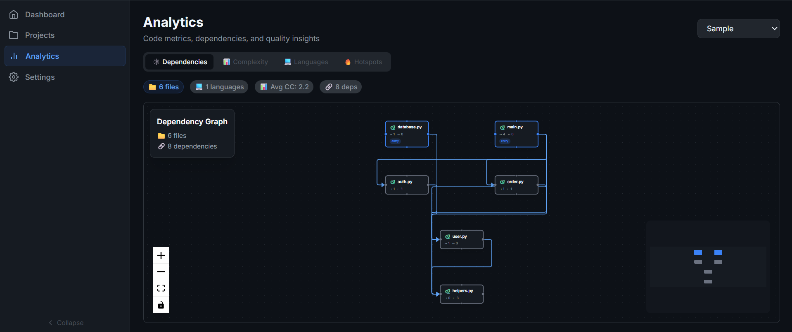
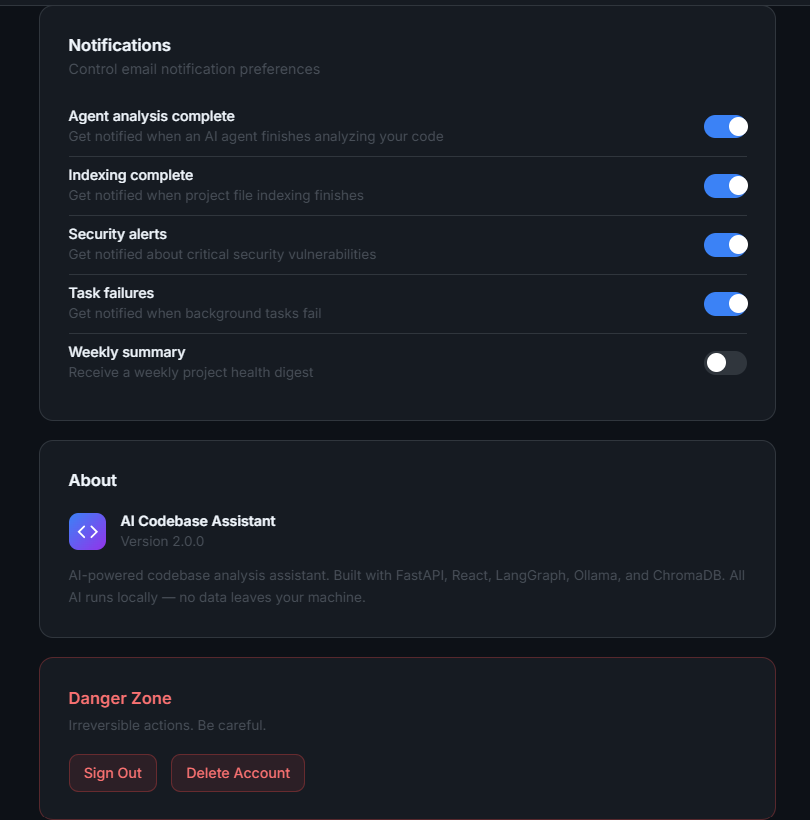



# 🤖 AI Codebase Assistant

**AI-Powered Codebase Understanding, Bug Detection & Multi-Agent Code Analysis Engine**

 

🌐 **[Live App](https://ai-codebase-assistant-git-main-tirths-projects-9c208144.vercel.app)** &nbsp;|&nbsp; ⚡ **[API Health](https://ai-codebase-backend-r721.onrender.com/health)**

---

## 📖 About

AI Codebase Assistant is a full-stack web application that lets developers upload their entire codebase and interact with it using natural language. It uses **Retrieval-Augmented Generation (RAG)** to ground every answer in your actual code — no hallucinations, no guessing. The system parses code at the AST level using Tree-sitter, chunks intelligently by function and class boundaries, embeds with HuggingFace sentence-transformers, and retrieves via ChromaDB for sub-second semantic search. It also ships with a **multi-agent AI framework** built on LangGraph — 7 specialized agents that autonomously find bugs, generate documentation, write tests, review code quality, scan for security vulnerabilities, suggest refactors, and analyze performance bottlenecks.

---

## 📸 Screenshots

### 🔐 Authentication

| Login | Register |
|-------|----------|
|  |  |

### 🏠 Dashboard

### 📁 Projects

### 💻 Project Workspace

### 🤖 AI Chat Interface

### 🧠 AI Agents Panel

### ⌨️ Command Palette

### 📊 Analytics Dashboard

### ⚙️ Settings

| Profile & Model Settings | Theme & API Configuration |
|--------------------------|--------------------------|
|  |  |

---

## 🛠️ Technologies

### Frontend
`React 18` `TypeScript` `Vite` `Tailwind CSS` `shadcn/ui` `Monaco Editor` `TanStack Query v5` `Zustand` `Socket.io Client` `React Flow` `Recharts` `Framer Motion` `React Hook Form` `Zod` `React Markdown` `Lucide React`

### Backend
`Python 3.11` `FastAPI` `SQLAlchemy 2.0 Async` `Alembic` `PostgreSQL` `Redis` `ChromaDB` `LangChain` `LangGraph` `Celery` `Pydantic v2` `HuggingFace Transformers` `Tree-sitter` `Ollama` `Groq` `bcrypt` `PyJWT`

### Infrastructure
`Vercel` `Render` `Docker` `GitHub Actions` `Upstash (Redis)` `Sentry` `UptimeRobot`

---

## ✨ Features

### 🔐 Authentication & Security
- Register / Login with email & password with full form validation
- JWT RS256 access tokens (15 min) + refresh token rotation
- Token blacklisting on logout — all active sessions invalidated immediately
- bcrypt password hashing with per-user salt rounds
- Per-user and per-IP sliding window rate limiting using Redis sorted sets
- CORS with explicit origin whitelist — no wildcard in production
- File upload validation for type, size, content, and MIME sniffing
- Security headers: HSTS, X-Frame-Options, X-Content-Type-Options, CSP
- SQL injection prevention via SQLAlchemy parameterized queries
- All secrets via environment variables — no hardcoding

### 📁 Project Management
- Create projects with name, description, language, and metadata
- Upload codebases as ZIP archives, individual files, or clone directly from GitHub URLs
- Automatic language detection across Python, JavaScript, TypeScript, Java, Go, Rust, C++
- Real-time indexing progress via WebSocket with animated progress bar in UI
- Project cards on dashboard with file count, language badge, and last activity timestamp
- Full CRUD with soft delete and restore
- Search and filter projects by language, status, and date

### 🔍 RAG Pipeline — Retrieval-Augmented Generation
- **Tree-sitter AST parsing** for 7 languages — extracts functions, classes, imports, and docstrings
- **Smart chunking engine** that splits at function and class boundaries rather than fixed character counts
- **HuggingFace `all-MiniLM-L6-v2`** embeddings — 384-dimensional vectors, runs locally for free
- **ChromaDB vector store** with per-project collections and metadata filtering
- **Semantic retrieval** with configurable top-k and relevance threshold filtering
- **Context-aware prompting** with templates that inject file names, line numbers, and surrounding context
- **Redis response caching** with MD5-hashed query keys and 1-hour TTL — repeated questions return instantly
- **Cache invalidation** triggered automatically when a project is re-indexed

### 💬 AI Chat Interface
- Natural language queries answered by AI with full codebase context
- **Real-time streaming** token by token via WebSocket — watch responses generate character by character
- **Conversation threading** — each session maintains full context history
- **Markdown rendering** with syntax-highlighted code blocks, headers, tables, and lists
- One-click **copy button** on every code block with visual confirmation animation
- **Typing indicator** with animated dots while AI is generating
- WebSocket **reconnection with exponential backoff** — never loses connection silently
- Chat history sidebar with session timestamps and preview of first message
- AI cites the exact files and line numbers it used to answer each question

### 🧠 AI Agents — Multi-Agent System (LangGraph)
- 🐛 **Bug Finder** — static analysis + AI detection of logic errors, null dereferences, and edge cases
- 📝 **Doc Generator** — generates JSDoc, docstrings, and README sections from code structure
- 🧪 **Test Writer** — writes pytest and Jest unit and integration tests with mocks and fixtures
- 👁️ **Code Reviewer** — checks style, complexity, naming, patterns, and SOLID principle adherence
- 🔒 **Security Scanner** — detects OWASP vulnerabilities, injection risks, hardcoded secrets, and insecure patterns
- ♻️ **Refactor Agent** — suggests DRY, KISS, and SOLID refactors with before/after diff view
- ⚡ **Performance Analyzer** — identifies O(n²) loops, N+1 queries, memory leaks, and bottlenecks
- Animated **circular progress rings** per agent showing real-time task completion
- Agent results in **structured cards** with severity badges and actionable suggestions
- **Multi-agent orchestration** — run all agents in sequence with dependency-aware execution
- Download agent reports as **PDF or Markdown** from results panel
- Per-file and per-function scope selection before running agents

### 💻 Monaco Code Viewer
- Full **VS Code Monaco Editor** embedded as a read-only code viewer
- **Syntax highlighting** for all supported languages
- **Line highlighting** — AI answers jump to the exact lines being referenced
- **File tree sidebar** with collapsible directories and language icons
- **Breadcrumb navigation** showing current file path
- **Diff viewer** for before/after comparison of refactor suggestions

### 📊 Analytics Dashboard
- **Cyclomatic complexity** scores per file and function with trend charts
- **Cognitive complexity** distribution across the codebase
- **Halstead metrics** — vocabulary, volume, difficulty, and effort
- **Code hotspot map** — files with highest churn and complexity combined
- **Duplicate code detector** — identifies similar code blocks above configurable threshold
- **Git history analysis** — commit frequency, contributor statistics, and blame attribution
- **Language breakdown** pie chart and file size distribution
- All charts built with **Recharts** — interactive tooltips and zoom

### 🗺️ Dependency Graph
- **Interactive React Flow** graph of all import and dependency relationships
- Zoom, pan, and click-to-inspect individual nodes
- Color-coded nodes by module type (component, service, utility, model)
- **Circular dependency detection** with highlighted cycles in red
- **Architecture diagram** auto-generated from codebase module structure
- Export graph as PNG or SVG

### ⌨️ Command Palette
- **Ctrl+K** opens a VS Code-style command palette from anywhere in the app
- Search and jump to any page, project, or file instantly
- Recent files and recently visited projects shown by default
- Keyboard navigation with arrow keys and Enter to confirm
- Fuzzy search across all projects, files, and available commands

### ⚡ Background Processing (Celery)
- ZIP extraction, file parsing, embedding generation, and indexing run in **background Celery tasks**
- **Real-time progress bar** updated via WebSocket as indexing progresses
- Task status cached in Redis — survives page refresh without losing progress
- Automatic retry with exponential backoff on transient failures
- Task monitoring dashboard showing queue depth, active workers, and completed tasks

### 🎨 UI / UX Design System
- **VS Code + Linear inspired** dark-mode-first premium interface
- Electric blue `#3B82F6` accent with purple gradient `#8B5CF6`
- **JetBrains Mono** for code, **Inter** for UI — consistent professional typography
- **Glassmorphism cards** with subtle borders and backdrop blur
- **Framer Motion** transitions at 150ms to 300ms throughout
- **Three-pane layout** — file tree | Monaco viewer | chat panel with resizable splits
- **Dark / light theme toggle** with system preference detection and persistent preference
- Fully **responsive** — works on tablet and desktop
- **Notification center** with real-time toast messages and notification history

### 📈 Observability & Monitoring
- `/health` — liveness probe for Docker and load balancers
- `/health/ready` — readiness probe checking all dependencies
- `/health/deep` — full inspection including DB, Redis, LLM, ChromaDB, and system resources
- `/metrics` — Prometheus-compatible text format for Grafana scraping
- **Sentry** error tracking (free tier) with FastAPI, SQLAlchemy, and Redis integrations
- **UptimeRobot** uptime monitoring with email and Slack alerts
- Request timing headers (`X-Response-Time-Ms`) on every response
- Slow request logging (> 1s) and very slow request warnings (> 5s)

### 🛡️ Rate Limiting
- Sliding window algorithm using Redis sorted sets
- 5-tier rate limiting:
  - Login: 5 req/min per IP
  - Register: 3 req/5min per IP
  - Chat queries: 30 req/min per user
  - Agent runs: 10 req/min per user
  - File uploads: 5 req/min per user
  - Default: 100 req/min per user

### 🧪 Testing
- **Backend unit tests** — pytest + pytest-asyncio covering auth, RAG, agents, and parsers
- **API integration tests** — httpx test client covering all endpoints
- **Frontend unit tests** — Vitest + React Testing Library
- **E2E tests** — Playwright covering login → upload → chat → agent flows
- GitHub Actions CI runs all tests on every push
